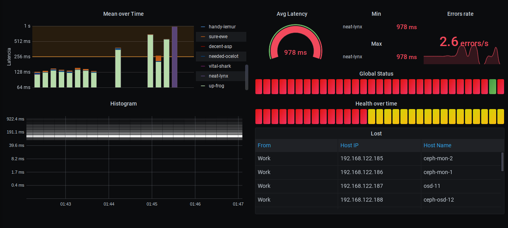

RustyPing
=========
Simple Rust application to send ICMP ping request to a set of hosts defined on a Redis database. Expose the info as metric HTTP Server for Prometheus.

Focused on datacenters to get a globa view of ICMP latency over all hosts.

## Metrics

| Metric | Description |
| ------ | ----------- |
| `rustyping_host_up` | Show if host is responding to ICMP |
| `rustyping_ping_error` | Counter of errors of ICMP |
| `rustyping_ping_last` | Last latency of ICMP |
| `rustyping_ping_latency_bucket` | Latency histogram from `0.1ms` to `1s` with `30` step and factor `1.37` for buckets  |
| `rustyping_ping_latency_sum` | Sum of all ICMP latency |
| `rustyping_ping_latency_count` | Count of all sended ICMP requests |

------------

| `RustyPing` label | Description |
| ----------------- | ----------- |
| `from` | Hostname of host where the ICMP is sended |
| `ip` | IP address of destination host (ip part of `name@ip` info from Redis database) |
| `name` | Name of destination host (name part of `name@ip` info from Redis database) |

## Usage

```
rustyping [OPTIONS] --redis_host <redis_host>
```

Option | Description | Environment variable | Default
-------- | ----------- | -------------------- | -------
`-r`/`--redis_host`| IP Address of Redis server | `RUSTYPING_REDIS_HOST` | ``
`-t`/`--ping_timeout`| Set the timeout in seconds | `RUSTYPING_PING_TIMEOUT` | `1.0`
`-i`/`--ping_interval`| Set the interval in seconds of each ping request | `RUSTYPING_PING_INTERVAL` | `5`

## Redis host

The Redis server need to contain a SET with the name `rustyping:targets` with members with this name `name@ip`.

## Grafana example

You can use grafana to view the info saved with Prometheus. Example dashboard can found on `grafana` folder.

